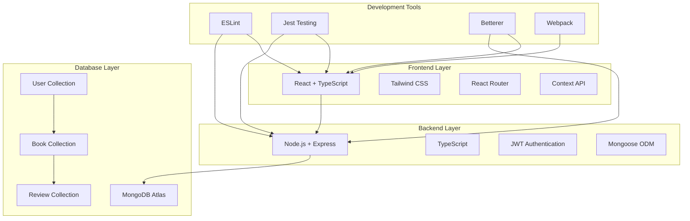

# Book Review Platform

A comprehensive MERN stack application for book reviews where users can sign up, log in, add books, and review books. Built with modern technologies, TypeScript, comprehensive testing, and production-ready features.

## Project Overview



## What's Been Accomplished

### Project Structure & Setup
- Complete MERN stack architecture with TypeScript
- Separate frontend and backend with clear folder structure
- Professional development setup with proper tooling
- Environment configuration with secure credential handling
- Git repository with comprehensive .gitignore

### Development Tools & Quality
- **TypeScript**: Full TypeScript implementation for both frontend and backend
- **ESLint**: Comprehensive linting configuration for code quality
- **Jest**: Unit testing framework setup for both frontend and backend
- **Betterer**: Code quality improvement tracking
- **Prettier**: Code formatting and consistency
- **Webpack**: Custom webpack configuration with optimization

### Security Implementation
- **Content Security Policy (CSP)**: Implemented in HTML template and webpack
- **Helmet**: Security headers for Express server
- **Rate Limiting**: API rate limiting to prevent abuse
- **JWT Authentication**: Secure token-based authentication
- **Password Hashing**: bcrypt for secure password storage
- **Input Validation**: express-validator for API input validation
- **CORS Configuration**: Secure cross-origin resource sharing

### Frontend Features
- **React 18**: Modern React with functional components and hooks
- **TypeScript**: Complete type safety throughout the application
- **React Router**: Client-side routing with protected routes
- **Context API**: Global state management for authentication
- **Tailwind CSS**: Modern utility-first CSS framework
- **Responsive Design**: Mobile-first responsive interface
- **Component Architecture**: Reusable component structure
- **Error Handling**: Comprehensive error handling and user feedback

### Backend Features
- **Express Server**: RESTful API with TypeScript
- **MongoDB Integration**: Database connection with Mongoose ODM
- **Authentication System**: Complete JWT-based auth with middleware
- **CRUD Operations**: Full Create, Read, Update, Delete operations
- **Data Validation**: Input validation and sanitization
- **Error Middleware**: Centralized error handling
- **Database Models**: User, Book, and Review schemas with relationships
- **Pagination**: Efficient data loading with pagination support
- **Search & Filter**: Text search and genre filtering capabilities

### Database Design
- **User Model**: Authentication and user management
- **Book Model**: Book information with owner relationships
- **Review Model**: Rating and review system with references
- **Indexing**: Database indexes for optimized queries
- **Relationships**: Proper document relationships and references
- **Validation**: Schema-level validation rules

### Testing & Quality
- **Testing Setup**: Jest configuration for both frontend and backend
- **Test Environment**: Separate test database setup
- **Code Coverage**: Coverage reporting configuration
- **Linting Rules**: Comprehensive ESLint rules for TypeScript
- **Code Quality Tracking**: Betterer setup for improvement tracking

### Documentation
- **Main README**: Comprehensive project documentation
- **Backend README**: Detailed backend documentation with mermaid diagrams
- **Frontend README**: Detailed frontend documentation with mermaid diagrams
- **API Documentation**: Complete API endpoint documentation
- **Architecture Diagrams**: Visual representation of system architecture
- **Setup Instructions**: Clear setup and deployment instructions

## Future Scope & Enhancements

### Frontend Enhancements
- [ ] **Complete UI Implementation**: Finish implementing all page components
- [ ] **Form Validation**: Add React Hook Form with Yup validation
- [ ] **Advanced Search**: Implement advanced search and filtering options
- [ ] **Infinite Scroll**: Replace pagination with infinite scroll
- [ ] **Dark/Light Mode**: Theme toggle functionality
- [ ] **PWA Features**: Service worker and offline support
- [ ] **Image Upload**: Book cover image upload functionality
- [ ] **Social Features**: User profiles and following system
- [ ] **Reading Lists**: Personal reading list management
- [ ] **Book Recommendations**: AI-powered book recommendations

### Backend Enhancements
- [ ] **Caching Layer**: Redis implementation for performance
- [ ] **File Upload**: Image upload service for book covers
- [ ] **Email Service**: Email notifications and verification
- [ ] **Advanced Analytics**: User behavior and book statistics
- [ ] **API Rate Limiting**: User-specific rate limiting
- [ ] **Audit Logging**: Comprehensive audit trail
- [ ] **Search Engine**: Elasticsearch integration for advanced search
- [ ] **Microservices**: Split into microservices architecture
- [ ] **GraphQL API**: Alternative GraphQL endpoint
- [ ] **Real-time Features**: WebSocket integration for live updates

### Security Enhancements
- [ ] **OAuth Integration**: Google, Facebook, GitHub login
- [ ] **Two-Factor Auth**: 2FA implementation
- [ ] **Password Reset**: Email-based password reset
- [ ] **Account Verification**: Email verification system
- [ ] **Session Management**: Advanced session handling
- [ ] **API Key Management**: API key system for third-party access

### Platform Extensions
- [ ] **Mobile App**: React Native mobile application
- [ ] **Desktop App**: Electron desktop application
- [ ] **Browser Extension**: Chrome/Firefox extension
- [ ] **API SDK**: JavaScript SDK for third-party developers

### DevOps & Deployment
- [ ] **Docker Containers**: Containerization for all services
- [ ] **CI/CD Pipeline**: GitHub Actions or Jenkins pipeline
- [ ] **Cloud Deployment**: AWS/GCP/Azure deployment
- [ ] **Monitoring**: Application performance monitoring
- [ ] **Load Balancing**: Multi-instance deployment
- [ ] **Database Optimization**: Query optimization and indexing
- [ ] **CDN Integration**: Content delivery network for assets

### Analytics & Insights
- [ ] **User Analytics**: User behavior tracking
- [ ] **Book Analytics**: Book popularity and trends
- [ ] **Review Analytics**: Review quality and sentiment analysis
- [ ] **Performance Metrics**: Application performance dashboards
- [ ] **A/B Testing**: Feature testing framework

## Technologies Used

### Frontend Stack
- **React 18** - Modern React with hooks and functional components
- **TypeScript** - Type-safe JavaScript development
- **Tailwind CSS** - Utility-first CSS framework
- **React Router** - Client-side routing
- **Context API** - State management
- **Axios** - HTTP client with interceptors
- **React Query** - Server state management
- **Webpack 5** - Module bundler and build tool

### Backend Stack
- **Node.js** - JavaScript runtime environment
- **Express.js** - Web application framework
- **TypeScript** - Type-safe server development
- **MongoDB** - NoSQL document database
- **Mongoose** - MongoDB object modeling
- **JWT** - JSON Web Token authentication
- **bcrypt** - Password hashing
- **Helmet** - Security middleware

### Development Tools
- **ESLint** - Code linting and quality
- **Prettier** - Code formatting
- **Jest** - Testing framework
- **Betterer** - Code quality tracking
- **ts-node-dev** - TypeScript development server
- **Supertest** - HTTP assertion testing

## 🏁 Quick Start

### Prerequisites
- Node.js (v16+)
- MongoDB Atlas account
- Git

### Backend Setup
```bash
cd backend
npm install
# Environment is already configured with provided MongoDB credentials

# Option 1: Seed with sample books (recommended for quick start)
npm run seed-books

# Option 2: Download and seed with Amazon books dataset from Kaggle
# First, set up Kaggle API credentials (one-time setup):
# 1. Go to https://www.kaggle.com/settings and create API token
# 2. Download kaggle.json and place at ~/.kaggle/kaggle.json
# 3. Run: chmod 600 ~/.kaggle/kaggle.json

# Then download the dataset using kagglehub
npm run download-dataset

# The script will show you the exact command to seed with the downloaded data
# Example: npm run seed-books "/path/to/downloaded/amazon-books.csv" 500

npm run dev
```

### Frontend Setup
```bash
cd frontend
npm install
npm start
```

### Production Build
```bash
# Backend
cd backend
npm run build
npm start

# Frontend
cd frontend
npm run build
```

## 🧪 Testing

```bash
# Backend tests
cd backend
npm test
npm run test:coverage

# Frontend tests
cd frontend
npm test
npm run test:coverage
```

## 📚 API Documentation

### Authentication Endpoints
- `POST /api/auth/register` - User registration
- `POST /api/auth/login` - User login

### Book Management Endpoints
- `GET /api/books` - Get all books (with pagination, search, filter)
- `POST /api/books` - Add new book (protected)
- `GET /api/books/:id` - Get book details with reviews
- `PUT /api/books/:id` - Update book (protected, owner only)
- `DELETE /api/books/:id` - Delete book (protected, owner only)

### Review Endpoints
- `POST /api/reviews` - Add review (protected)
- `PUT /api/reviews/:id` - Update review (protected, owner only)
- `DELETE /api/reviews/:id` - Delete review (protected, owner only)
- `GET /api/reviews/book/:bookId` - Get reviews for a book

## 🏗️ Project Structure

```
/
├── backend/                 # Node.js/Express API server
│   ├── src/
│   │   ├── config/         # Database configuration
│   │   ├── middleware/     # Express middleware
│   │   ├── models/         # Mongoose data models
│   │   ├── routes/         # API route handlers
│   │   ├── utils/          # Utility functions
│   │   └── server.ts       # Express server setup
│   ├── package.json
│   ├── tsconfig.json
│   └── README.md
├── frontend/               # React application
│   ├── public/             # Static assets
│   ├── src/
│   │   ├── components/     # Reusable components
│   │   ├── context/        # React context providers
│   │   ├── pages/          # Page components
│   │   ├── services/       # API service layers
│   │   ├── styles/         # CSS and styling
│   │   └── types/          # TypeScript definitions
│   ├── package.json
│   ├── webpack.config.js
│   └── README.md
└── README.md               # This file
```

## 📄 License

MIT License

---

**Note**: This project represents a comprehensive implementation of a modern MERN stack application with production-ready features, security measures, and professional development practices. The current implementation provides a solid foundation for further development and enhancement.
