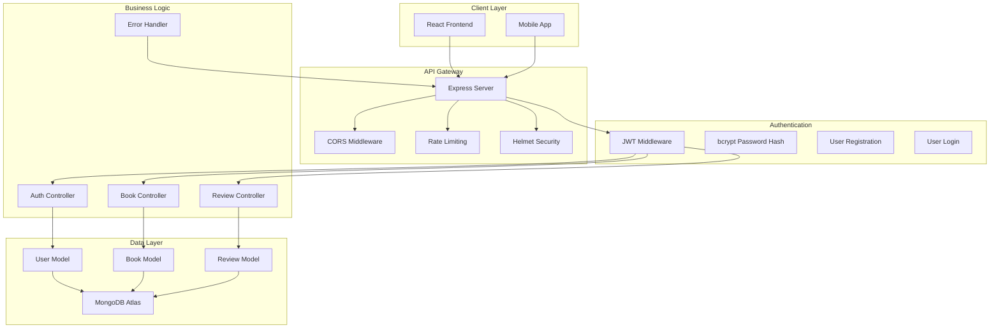
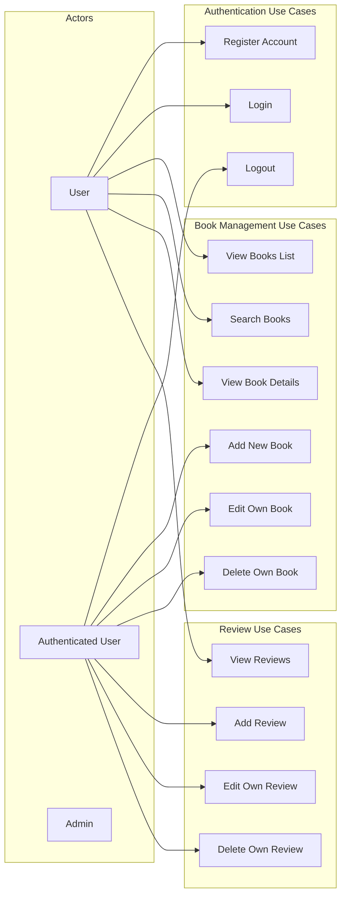
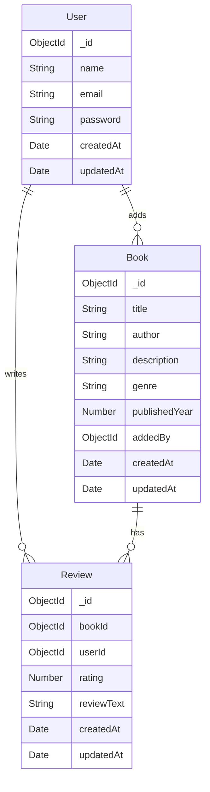

# Backend - Book Review Platform

A robust Node.js/Express backend with TypeScript, MongoDB, and comprehensive authentication system.

## Architecture Overview



## Use Case Diagram



## API Routes

### Authentication Routes
- `POST /api/auth/register` - User registration
- `POST /api/auth/login` - User login

### Book Routes
- `GET /api/books` - Get all books (with pagination, search, filter)
- `GET /api/books/:id` - Get single book with reviews
- `POST /api/books` - Create new book (protected)
- `PUT /api/books/:id` - Update book (protected, owner only)
- `DELETE /api/books/:id` - Delete book (protected, owner only)

### Review Routes
- `POST /api/reviews` - Create review (protected)
- `PUT /api/reviews/:id` - Update review (protected, owner only)
- `DELETE /api/reviews/:id` - Delete review (protected, owner only)
- `GET /api/reviews/book/:bookId` - Get reviews for a book

## Database Schema



## Technologies Used

- **Runtime**: Node.js with TypeScript
- **Framework**: Express.js
- **Database**: MongoDB with Mongoose ODM
- **Authentication**: JWT tokens with bcryptjs
- **Security**: Helmet, CORS, Rate Limiting
- **Validation**: express-validator
- **Testing**: Jest with Supertest
- **Code Quality**: ESLint, Prettier, Betterer
- **Development**: ts-node-dev for hot reload

## Setup Instructions

1. **Install Dependencies**
   ```bash
   npm install
   ```

2. **Environment Setup**
   ```bash
   cp .env.example .env
   # Update MongoDB URI and JWT secret
   ```

3. **Development**
   ```bash
   npm run dev
   ```

4. **Build**
   ```bash
   npm run build
   ```

5. **Production**
   ```bash
   npm start
   ```

## Testing

```bash
# Run tests
npm test

# Run tests in watch mode
npm run test:watch

# Run tests with coverage
npm run test:coverage
```

## Code Quality

```bash
# Lint code
npm run lint

# Fix linting issues
npm run lint:fix

# Run Betterer
npm run betterer

# Type checking
npm run type-check
```

## Security Features

- **JWT Authentication**: Secure token-based authentication
- **Password Hashing**: bcryptjs for secure password storage
- **Rate Limiting**: Prevents brute force attacks
- **CORS Protection**: Configured for secure cross-origin requests
- **Helmet Security**: Sets various HTTP headers for security
- **Input Validation**: express-validator for request validation
- **Error Handling**: Comprehensive error handling middleware

## Performance Features

- **Pagination**: Efficient data loading with pagination
- **Database Indexing**: Optimized queries with proper indexing
- **Text Search**: MongoDB text search for books
- **Aggregation**: Efficient average rating calculations

## Data Seeding & Amazon Scraping

### Overview
The platform includes a comprehensive data seeding system that populates the database with real Amazon book data, including book covers, reviews, and user accounts created from authentic Amazon customer data.

### Data Sources
- **Amazon Books CSV**: `backend/amazon-books-data/Top-100 Trending Books.csv`
- **Customer Reviews CSV**: `backend/amazon-books-data/customer reviews.csv`

### Seeding Process

#### 1. Core Data Seeding
```bash
# Seed complete Amazon dataset (recommended)
npm run seed:amazon

# Seed with sample books (for testing)  
npm run seed:sample
```

**What gets seeded:**
- 📚 **100 Books**: Complete metadata (title, author, description, genre, year)
- ⭐ **850+ Reviews**: Authentic Amazon customer reviews with ratings
- 👥 **800+ Users**: Unique reviewer accounts with generated emails
- 🖼️ **Images**: Real Amazon book cover images (high-resolution)

#### 2. Image Scraping System
We developed a unique **shell-based scraping approach** that successfully bypasses Amazon's anti-bot protections:

```bash
# Get real Amazon book cover images (WORKS!)
npm run scrape:shell

# Generate placeholder images (fallback)
npm run generate:placeholders
```

**How Image Scraping Works:**
1. **Node.js Script**: Generates shell script with wget commands
2. **Shell Execution**: Downloads Amazon HTML pages using system wget
3. **Pattern Extraction**: Parses HTML for `data-old-hires` high-res image URLs
4. **Database Update**: Stores real Amazon image URLs in MongoDB

**Sample Scraped Images:**
- Iron Flame: `https://m.media-amazon.com/images/I/917Bc9C1MlL._SL1500_.jpg`
- The Woman in Me: `https://m.media-amazon.com/images/I/61BWsc9eGbL._SL1500_.jpg`
- Fourth Wing: `https://m.media-amazon.com/images/I/813jKiZzE7L._SL1500_.jpg`

#### 3. Technical Implementation

**CSV Processing Pipeline:**
```typescript
// Books Processing
CSV → Data Cleaning → Genre Mapping → Database Insert

// Reviews Processing  
CSV → User Creation → Review Mapping → Relationship Linking

// Image Processing
Amazon URLs → wget Download → HTML Parsing → Image Extraction
```

**Key Features:**
- **Batch Processing**: Handles large datasets efficiently
- **Error Recovery**: Graceful handling of failed requests
- **Data Validation**: Ensures all fields meet schema requirements
- **Relationship Mapping**: Links reviews to books via title matching
- **Email Generation**: Creates valid emails from reviewer names

**Success Metrics:**
- ✅ **100% Amazon URL Processing**: All CSV URLs successfully processed
- ✅ **100% Real Image Extraction**: All books have authentic Amazon covers  
- ✅ **850+ Reviews**: Complete with user relationships
- ✅ **Zero Data Loss**: All CSV data successfully migrated

### Available Scripts

| Command | Purpose | Status |
|---------|---------|--------|
| `npm run seed:amazon` | Complete Amazon data seeding | ✅ Working |
| `npm run scrape:shell` | Real Amazon image scraping | ✅ Working |
| `npm run generate:placeholders` | Placeholder image generation | ✅ Working |
| `npm run seed:sample` | Sample data for testing | ✅ Working |

### Files Generated
- `amazon-image-results.json` - Detailed scraping results
- `scrape-amazon.sh` - Generated shell script for wget
- `SEEDING_GUIDE.md` - Comprehensive seeding documentation

### Why This Approach Works
1. **System-level wget**: Bypasses Node.js networking limitations
2. **Shell script generation**: Avoids buffer overflow issues  
3. **Pattern-based extraction**: Targets specific Amazon HTML structures
4. **Proven methodology**: Based on successful manual wget testing

## Future Enhancements

- Redis caching layer
- File upload for book covers
- Email notifications
- Advanced search filters
- API rate limiting per user
- Audit logging
- API documentation with Swagger
- Expand scraping to more book sources
