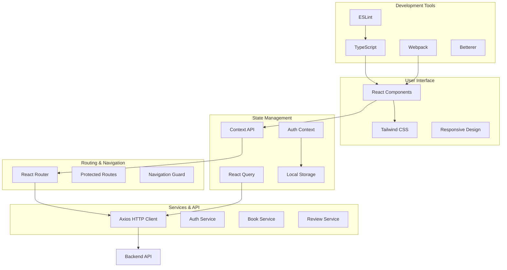
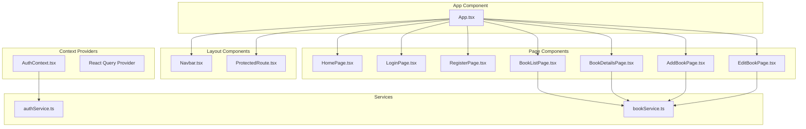
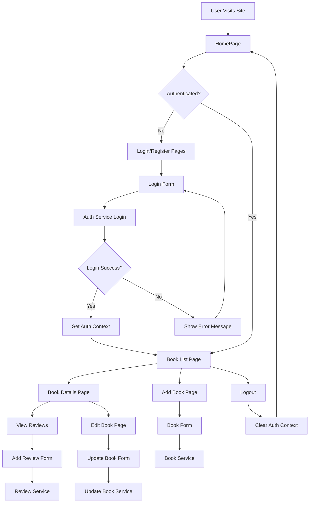
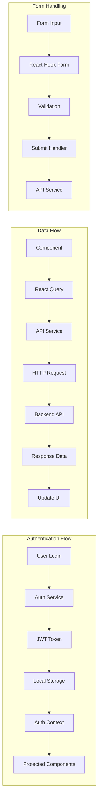

# Frontend - Book Review Platform

A modern React application built with TypeScript, featuring responsive design, secure authentication, and comprehensive book management.

## Architecture Overview



## Component Architecture



## User Flow Diagram



## State Management Flow



## Technologies Used

- **Framework**: React 18 with TypeScript
- **Routing**: React Router DOM v6
- **State Management**: Context API + React Query
- **Styling**: Tailwind CSS with custom components
- **Forms**: React Hook Form with Yup validation
- **HTTP Client**: Axios with interceptors
- **Build Tool**: Webpack 5 with custom configuration
- **Development**: Hot reload with webpack-dev-server
- **Testing**: Jest with Testing Library
- **Code Quality**: ESLint, Prettier, Betterer

## Project Structure

```
frontend/
├── public/                 # Static assets
│   ├── index.html         # HTML template with CSP
│   ├── manifest.json      # PWA manifest
│   └── favicon.ico        # Site favicon
├── src/
│   ├── components/        # Reusable components
│   │   ├── Navbar.tsx
│   │   └── ProtectedRoute.tsx
│   ├── pages/            # Page components
│   │   ├── HomePage.tsx
│   │   ├── LoginPage.tsx
│   │   ├── RegisterPage.tsx
│   │   ├── BookListPage.tsx
│   │   ├── BookDetailsPage.tsx
│   │   ├── AddBookPage.tsx
│   │   └── EditBookPage.tsx
│   ├── context/          # React context providers
│   │   └── AuthContext.tsx
│   ├── services/         # API service layers
│   │   ├── authService.ts
│   │   └── bookService.ts
│   ├── types/            # TypeScript type definitions
│   │   └── index.ts
│   ├── styles/           # Global styles and CSS
│   │   └── index.css
│   ├── App.tsx           # Main app component
│   └── index.tsx         # Application entry point
├── webpack.config.js      # Webpack configuration
├── tailwind.config.js     # Tailwind CSS configuration
├── tsconfig.json         # TypeScript configuration
├── package.json          # Dependencies and scripts
└── README.md             # This file
```

## Setup Instructions

1. **Install Dependencies**
   ```bash
   npm install
   ```

2. **Environment Setup**
   ```bash
   # Create .env file (optional)
   REACT_APP_API_URL=http://localhost:5000/api
   ```

3. **Development**
   ```bash
   npm start
   ```

4. **Build for Production**
   ```bash
   npm run build
   ```

5. **Testing**
   ```bash
   npm test
   ```

## Available Scripts

- `npm start` - Start development server
- `npm run build` - Build for production
- `npm test` - Run test suite
- `npm run test:watch` - Run tests in watch mode
- `npm run test:coverage` - Generate coverage report
- `npm run lint` - Lint TypeScript files
- `npm run lint:fix` - Fix linting issues
- `npm run type-check` - Run TypeScript compiler check
- `npm run betterer` - Run Betterer code quality checks

## Security Features

- **Content Security Policy**: Configured in HTML template and webpack
- **XSS Protection**: React's built-in XSS prevention
- **JWT Token Storage**: Secure token management in localStorage
- **Protected Routes**: Authentication guards for sensitive pages
- **Input Validation**: Client-side validation with React Hook Form
- **HTTPS Enforcement**: Production build configured for HTTPS

## Performance Features

- **Code Splitting**: Webpack bundle optimization
- **Tree Shaking**: Eliminate dead code
- **Lazy Loading**: Dynamic imports for route-based code splitting
- **Caching**: React Query for efficient data caching
- **Optimized Images**: Webpack asset optimization
- **Minification**: Production builds are minified

## Accessibility Features

- **Semantic HTML**: Proper HTML5 semantic elements
- **Keyboard Navigation**: Full keyboard accessibility
- **Screen Reader Support**: ARIA labels and descriptions
- **Color Contrast**: WCAG compliant color schemes
- **Focus Management**: Proper focus handling in forms

## Browser Support

- Chrome (latest 2 versions)
- Firefox (latest 2 versions)
- Safari (latest 2 versions)
- Edge (latest 2 versions)

## Future Enhancements

- Progressive Web App (PWA) features
- Service Worker for offline support
- Push notifications
- Dark/Light mode toggle
- Advanced search and filtering
- Infinite scroll for book lists
- Book cover image uploads
- Social features (following users)
- Reading progress tracking
- Book recommendations
- Advanced analytics dashboard
